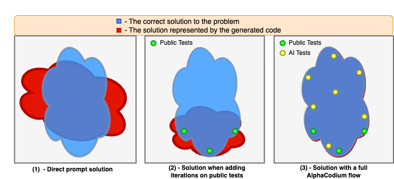
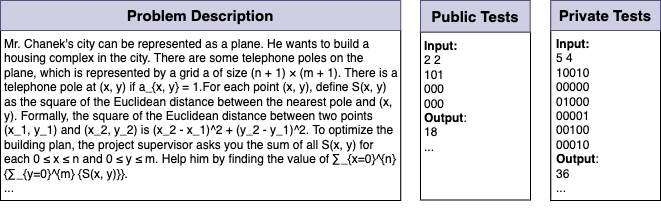

# Code Generation with AlphaCodium: From Prompt Engineering to Flow Engineering

[Paper](https://arxiv.org/abs/2401.08500) |
[Dataset](https://huggingface.co/datasets/talrid/CodeContests_valid_and_test_AlphaCodium/blob/main/codecontests_valid_and_test_processed_alpha_codium.zip)

Official Implementation
> Tal Ridnik, Dedy Kredo, Itamar Friedman <br/> CodiumAI

## Table of Contents
- [Abstract](#abstract)
- [Installation](#installation)
- [How to run](#how-to-run)
- [Technical Q&A](#technical-qa)
- [Broader Applicability](#broader-applicability)
- [Acknowledgments](#acknowledgments)
- [Citation](#citation)

## Abstract

Code generation problems differ from common natural language problems - they require matching the exact syntax of the target language, identifying happy paths and edge cases, paying attention to numerous small details in the problem spec, and addressing other code-specific issues and requirements. Hence, many of the optimizations and tricks that have been successful in natural language generation may not be effective for code tasks.

In this work, we propose a new approach to code generation by LLMs, which we call AlphaCodium - a test-based, multi-stage, code-oriented iterative flow, that improves the performances of LLMs on code problems.

We tested AlphaCodium on a challenging code generation dataset called CodeContests, which includes competitive programming problems from platforms such as Codeforces. The proposed flow consistently and significantly improves results.
On the validation set, for example, GPT-4 accuracy (pass@5) increased from 19% with a single well-designed direct prompt to 44% with the AlphaCodium flow. 

Many of the principles and best practices we acquired in this work, we believe, are broadly applicable to general code generation tasks.

<p align="center">
 <table class="tg">
  <tr>
    <td class="tg-c3ow"></td>
<tr>
    <td class="tg-c3ow"></td>

  </tr>
</table>
</p>


## Installation

(1) setup a virtual environment and run: `pip install -r requirements.txt`

(2) Duplicate the file `alpha_codium/settings/.secrets_template.toml`, rename it as `.secrets.toml`, and fill your openai api key:
```
[openai]
key = "..."
```

(3) Download the processed CodeContest validation and test dataset from [hugging face](https://huggingface.co/datasets/talrid/CodeContests_valid_and_test_AlphaCodium/blob/main/codecontests_valid_and_test_processed_alpha_codium.zip), extract the zip file, and placed the extracted folder in the root of the project.

## How to run

### Configuration
The file: `alpha_codium/settings/configuration.toml` contains the configuration for the project.
In the `config` section you can choose the model you want to use ("gpt-4", "gpt-3.5-turbo-16k", or others).

### Solving a specific problem
To solve a specific problem with AlphaCodium, from the root folder run:
```
python -m alpha_codium.solve_problem \
--dataset_name /path/to/dataset \
--split_name test \
--problem_number 0
```
- The `dataset_name` is the path to the dataset folder you downloaded in the installation step.
- Note that the validation set contains 117 problems, and the test set contains 165 problems, so the `problem_number` parameter should be accordingly (zero-based)
- The `split_name` can be either `valid` or `test`.
- The followings sections in the configuration file: 
`solve`, `self_reflection`,`possible_solutions`,`generate_ai_tests`,`initial_code_generation`,`public_tests`, `ai_tests`  
enable to adjust possible configurations for the different stages of the flow.
- Each run logs the results to a file named `alpha_codium/example.log`. Reviewing the log file is a good way to understand what is going on in each stage of the flow.

Example problem (test set, problem number 12):
<p align="center">
 <table class="tg">
  <tr>
    <td class="tg-c3ow"></td>
    </tr>
</table>
</p>

### Solving the entire dataset
to solve the entire dataset with AlphaCodium, from the root folder run:
```
python -m alpha_codium.solve_dataset \
--dataset_name /path/to/dataset \
--split_name test
--database_solution_path /path/to/output/dir/dataset_output.json
```

- The `split_name` can be either `valid` or `test`.
- `database_solution_path` is the path to the directory where the solutions will be saved.
- The `dataset` section in the configuration file contains the configuration for the running and evaluation a dataset.
- Note that this is a long process, and it may take a few days to complete with large models (e.g. GPT-4) and several iterations per problem. 
- `dataset.num_iterations` defines the number of iterations for each problem (pass@K). For large number of iterations, it is recommended to introduce some randomness and different options for each iteration to achieve top results.

### Running the evaluation

Once you generate a solution for the entire dataset (valid or test), you can evaluate it by running:
```
python -m alpha_codium.evaluate_dataset\
--dataset_name /path/to/dataset\
--split_name test\
--database_solution_path /path/to/output/dir/dataset_output.json
```

## Technical Q&A
Aggregating some technical questions we received about this project:
___
**Q: How much time did you spend on "prompt engineering" compared to "flow engineering"?**<br><br>
**A:** Structured output almost completely eliminates the need for simple prompt engineering.
We estimate that ~95% of the time we did more high-level design, reasoning, injecting data at the correct places, ..., a.k.a. "flow engineering".
___

**Q: How do you know that there wasn't a data leakage ?** <br><br>
**A:** The test set of CodeContests dataset comprises from problems published after September 2021, while the GPT-4 model variant we used (gpt-4-0613) has a data cutoff of September 2021. Hence, there is no data leakage for GPT4, on the test set.
For other models like DeepSeek, we cannot be sure. However, note that our [main result](./pics/comparison.png) is a comparison of "direct prompt" vs. "AlphaCodium flow". Data leakage would help both approaches, so the relative improvement of AlphaCodium flow is still valid.
___

**Q: Is this project relevant only to specific programming languages?**<br><br>
**A:** No. The proposed flow is language agnostic. We generated solutions in Python, but the flow can be applied to any language.
___

**Q: How did you manage the context window?** <br><br>
**A:** We used models with a context window of 8192 tokens, and we did not encounter cases where it did not suffice.
However, we clearly observed that as the context we used in practice grows larger (let's say, above 4000 tokens), the model starts to "ignore" some of the information in the context. Hence, there is a clear tradeoff:
- Injecting the results of previous stages into the context, may help the model to generate better code.
- However, it may also cause the model to ignore specific details and nuances from the problem description.
___

**Q: Is this work "realistic" in terms of the number of LLM calls?** <br><br>
**A:** In comparison to AlphaCode, we do four orders of magnitude (!) fewer [calls](./pics/computational_effort.png) (per solution AlphaCodium does 15-20 calls).
Yet we acknowledge that for some applications, this may still be too much, and more optimizations are needed. We however believe that many of the ideas and principles we acquired in this work are broadly applicable, even when the number of calls is further limited.
___
**Q: Why do you iterate only on the generated code, and not on the AI-generated tests?** <br><br>
**A:** For code problems in CodeContests, the tests are a list of input-output pairs. Hence, you don't really learn anything new when you "fix" a test - you just change its output to the prediction of the generated code. Instead of fixing tests, we preferred to always try and fix the code, while using "test anchors". (see the [paper](https://arxiv.org/abs/2401.08500) for more details).
However, for other code generation tasks, where the tests are more complex and actually contain runnable code, iterating on the tests, in addition to iterating on the generated code, may be beneficial.


## Broader Applicability
While this work presents results on CodeContests dataset, we believe that it has a broader applicability.

First and foremost, we feel that the proposed AlphaCodium [flow](./pics/proposed_flow.png), with reasonable adjustments, can be used as a more general framework for other code generation tasks.

Secondly, many of the design concepts, principles, and tricks we acquired in this work are broadly applicable as-is to any general code generation tasks. For example:
- **YAML Structured output**: asking the model to generate an output in YAML format, equivalent to a given Pydantic class
- **Semantic reasoning via bullet points analysis**: bullet points analysis encourages an in-depth understanding of the problem, and force the model to divide the output into logical semantic sections, leading to improved results
- **LLMs do better when generating a modular code**: when clearly asking the model to: `divide the generated code into small sub-functions, with meaningful names and functionality`, we observe a better-produced code, with fewer bugs, and higher success rates for the iterative fixing stages.
- **Soft decisions with double validation**: with a double validation process, we add an extra step where, given the generated output, the model is asked to re-generate the same output, but correct it if needed
- **Leave room for exploration**: since the model can be wrong, it’s better to avoid irreversible decisions, and leave room for exploration and code iterations with different possible solutions

The list above is partial. See the [paper](https://arxiv.org/abs/2401.08500) for more details. The code provided [in this repo](./alpha_codium/settings) can be used as a reference for better understanding the proposed concepts, and for applying them to other code generation tasks.

## Acknowledgments
Our process CodeContests dataset is based on the original [CodeContests](https://huggingface.co/datasets/deepmind/code_contests) dataset.
We removed the train set (which is not relevant for our work), and did some post-processing and cleaning to the validation and test sets.


## Citation
```
@misc{ridnik2024code,
      title={Code Generation with AlphaCodium: From Prompt Engineering to Flow Engineering}, 
      author={Tal Ridnik and Dedy Kredo and Itamar Friedman},
      year={2024},
      eprint={2401.08500},
      archivePrefix={arXiv},
      primaryClass={cs.LG}
}
```
